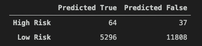
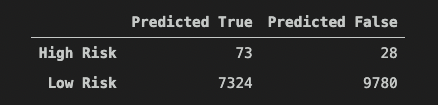
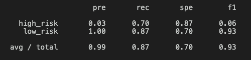

# Credit Risk Analysis

## Project Summary  
This analysis applies Supervised Machine Learning models to predict Credit Risk. Since Credit Risk is an inherently unbalanced classification problem, as good loans easily outnumber risky loans. The analysis employs different techniques to train and evaluate models with unbalanced classes, which are as follows:

- Oversampling:
  - Naive Random Oversampling algorithm
  - SMOTE algorithm
 
- Undersampling:
  - Cluster Centroids algorithm

- Combination (Over & Under) Sampling:
  - SMOTEENN algorithm

- Ensemble Learners:
  - Balanced Random Forest algorithm
  - Easy Ensemble AdaBoost algorithm 

## Results

#### Naive Random Oversampling: 
- Model balanced accuracy score: 65%
- Precision score: 0.01, when this model predicted TRUE for High Credit Risk, the precision was only 1%.
- Recall score: 0.72, out of the total samples this model only detects 72% of the High-Risk samples correctly.

    

#### SMOTE:
- Model balanced accuracy score: 66%
- Precision score: 0.01, when this model predicted TRUE for High Credit Risk, the precision was only 1%.
- Recall score: 0.63, out of the total samples this model only detects 63% of the High-Risk samples correctly.

    

#### Cluster Centroids:
- Model balanced accuracy score: 54%
- Precision score: 0.01, when this model predicted TRUE for High Credit Risk, the precision was only 1%.
- Recall score: 0.69, out of the total samples this model only detects 69% of the High-Risk samples correctly.

    

#### SMOTEENN:
- Model balanced accuracy score: 65%
- Precision score: 0.01, when this model predicted TRUE for High Credit Risk, the precision was only 1%.
- Recall score: 0.72, out of the total samples this model only detects 72% of the High-Risk samples correctly.

    

#### Balanced Random Forest:
- Model balanced accuracy score: 79%
- Precision score: 0.03, when this model predicted TRUE for High Credit Risk, the precision was only 3%.
- Recall score: 0.70, out of the total samples this model only detects 70% of the High-Risk samples correctly.

    

#### Easy Ensemble AdaBoost:
- Model balanced accuracy score: 93%
- Precision score: 0.09, when this model predicted TRUE for High Credit Risk, the precision was only 9%.
- Recall score: 0.92, out of the total samples this model detects 92% of the High-Risk samples correctly.

    

## Conclusion 
In conclusion, the analysis suggests when it comes to predicting Credit Risk out of these five machine learning models Easy Ensemble AdaBoost algorithm performs the best. As seen in the results, it has the least number of False Negatives (Type II error) out of the five models. Not only that it also has the highest Recall score / sensitivity for detecting High Risk samples correctly and the models Precision score for low-risk loans is at 100%. Taking all these factors into account, out of these five models I would recommend Easy Ensemble algorithm for predicting Credit Risk.

## Resources
Software/libraries:
- Python 3.7
- Pandas
- imbalanced-learn
- scikit-learn
